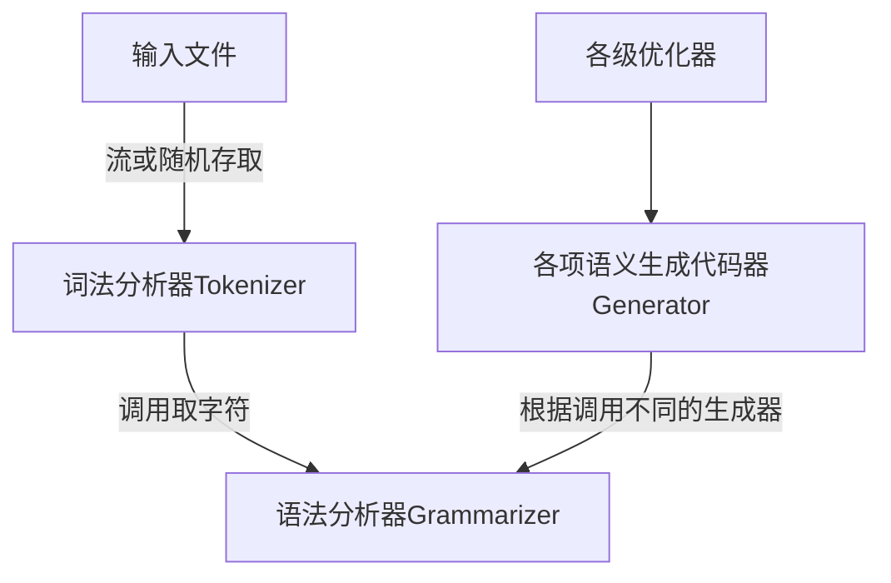

# SysY_Compiler
SysY 语⾔编译器，是 C 语⾔的⼀个⼦集

## 整体架构

```mermaid
graph TD
A[词法分析器Tokenizer]
B[语法分析器Grammarizer]
A -->|调用取字符| B
C[输入文件]
C -->|流或随机存取| A
D[各项语义生成代码器Generator]
E[各级优化器]
D -->|根据调用不同的生成器| B
E --> D
```