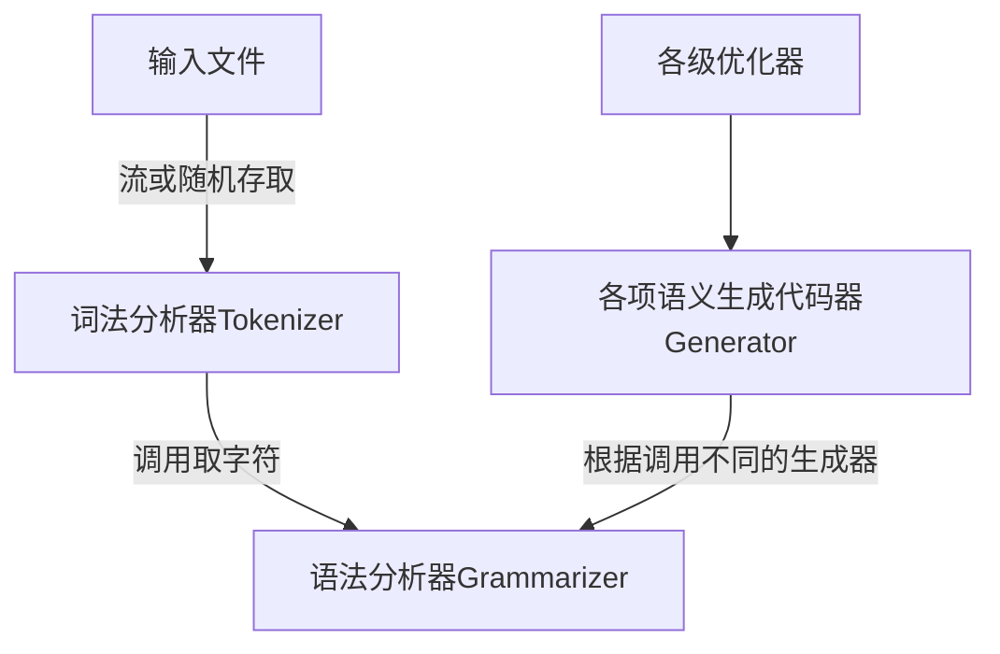

# SysY_Compiler
SysY 语⾔编译器，是 C 语⾔的⼀个⼦集

## 整体架构

##文法
> 编译单元 CompUnit → {Decl} {FuncDef} MainFuncDef 
> // 1.是否存在Decl 2.是否存在
FuncDef
声明 Decl → ConstDecl | VarDecl 
> // 覆盖两种声明
常量声明 ConstDecl → 'const' BType ConstDef { ',' ConstDef } ';' // 1.花括号内重
复0次 2.花括号内重复多次
基本类型 BType → 'int' // 存在即可
常数定义 ConstDef → Ident { '[' ConstExp ']' } '=' ConstInitVal // 包含普通变
量、⼀维数组、⼆维数组共三种情况
常量初值 ConstInitVal → ConstExp
| '{' [ ConstInitVal { ',' ConstInitVal } ] '}' // 1.常表达式初值 2.⼀维数组初值
3.⼆维数组初值
变量声明 VarDecl → BType VarDef { ',' VarDef } ';' // 1.花括号内重复0次 2.花括号内
重复多次
变量定义 VarDef → Ident { '[' ConstExp ']' } // 包含普通变量、⼀维数组、⼆维数组定义
| Ident { '[' ConstExp ']' } '=' InitVal
变量初值 InitVal → Exp | '{' [ InitVal { ',' InitVal } ] '}'// 1.表达式初值 2.⼀
维数组初值 3.⼆维数组初值
函数定义 FuncDef → FuncType Ident '(' [FuncFParams] ')' Block // 1.⽆形参 2.有形
参
主函数定义 MainFuncDef → 'int' 'main' '(' ')' Block // 存在main函数
函数类型 FuncType → 'void' | 'int' // 覆盖两种类型的函数
函数形参表 FuncFParams → FuncFParam { ',' FuncFParam } // 1.花括号内重复0次 2.花括
号内重复多次
函数形参 FuncFParam → BType Ident ['[' ']' { '[' ConstExp ']' }] // 1.普通变量
2.⼀维数组变量 3.⼆维数组变量
语句块 Block → '{' { BlockItem } '}' // 1.花括号内重复0次 2.花括号内重复多次
语句块项 BlockItem → Decl | Stmt // 覆盖两种语句块项
语句 Stmt → LVal '=' Exp ';' // 每种类型的语句都要覆盖
| [Exp] ';' //有⽆Exp两种情况
| Block
| 'if' '(' Cond ')' Stmt [ 'else' Stmt ] // 1.有else 2.⽆else
| 'while' '(' Cond ')' Stmt
| 'break' ';' | 'continue' ';'
| 'return' [Exp] ';' // 1.有Exp 2.⽆Exp
| LVal = 'getint''('')'';'
| 'printf''('FormatString{,Exp}')'';' // 1.有Exp 2.⽆Exp
表达式 Exp → AddExp 注：SysY 表达式是int 型表达式 // 存在即可
条件表达式 Cond → LOrExp // 存在即可
左值表达式 LVal → Ident {'[' Exp ']'} //1.普通变量 2.⼀维数组 3.⼆维数组
基本表达式 PrimaryExp → '(' Exp ')' | LVal | Number // 三种情况均需覆盖
数值 Number → IntConst // 存在即可
⼀元表达式 UnaryExp → PrimaryExp | Ident '(' [FuncRParams] ')' // 3种情况均需覆盖,
函数调⽤也需要覆盖FuncRParams的不同情况
| UnaryOp UnaryExp // 存在即可
单⽬运算符 UnaryOp → '+' | '−' | '!' 注：'!'仅出现在条件表达式中 // 三种均需覆盖
函数实参表 FuncRParams → Exp { ',' Exp } // 1.花括号内重复0次 2.花括号内重复多次 3.
Exp需要覆盖数组传参和部分数组传参
乘除模表达式 MulExp → UnaryExp | MulExp ('*' | '/' | '%') UnaryExp //
1.UnaryExp 2.* 3./ 4.% 均需覆盖
加减表达式 AddExp → MulExp | AddExp ('+' | '−') MulExp // 1.MulExp 2.+ 需覆盖 3.-
需覆盖
关系表达式 RelExp → AddExp | RelExp ('<' | '>' | '<=' | '>=') AddExp // 1.AddExp
2.< 3.> 4.<= 5.>= 均需覆盖
相等性表达式 EqExp → RelExp | EqExp ('==' | '!=') RelExp // 1.RelExp 2.== 3.!=
均需覆盖
逻辑与表达式 LAndExp → EqExp | LAndExp '&&' EqExp // 1.EqExp 2.&& 均需覆盖
逻辑或表达式 LOrExp → LAndExp | LOrExp '||' LAndExp // 1.LAndExp 2.|| 均需覆盖
常量表达式 ConstExp → AddExp 注：使⽤的Ident 必须是常量 // 存在即可

## AST结构
> CompUnit -> decls:{TypeTree} funcs:{FuncDecl}
> 
> TypeTree -> type:Word vars:{VarDecl}
> 
> VarDecl -> ident:Word arrayDims:{Node} val:Node
> 
> FuncDecl -> type:Word name:Word params:{FuncFParam}
> body:Block
> 
> FuncFParam -> type:Word ident:Word arrayDims:{Node}
> 
> Block -> stmts:{Node}
> 
> AddExp -> lval:Node rval:Node
> 
> DivExp -> lval:Node rval:Node
> 
> EqExp -> lval:Node rval:Node
> 
> FuncCall -> ident:Word params:{Node}
> 
> GeqExp -> lval:Node rval:Node
> 
> GrtExp -> lval:Node rval:Node
> 
> IfExp -> cond:Node ifBody:Block hasElse:boolean
> elseBody:Block
> 
> LAndExp -> lval:Node rval:Node
> 
> LeqExp -> lval:Node rval:Node
> 
> LessExp -> lval:Node rval:Node
> 
> LOrExp -> lval:Node rval:Node
> 
> LVal -> ident:Word index:{Node}
> 
> MinusExp -> val:Node
> 
> ModExp -> lval:Node rval:Node
> 
> MulExp -> lval:Node rval:Node
> 
> NeqExp -> lval:Node rval:Node
> 
> NotExp -> val:Node
> 
> ParentExp -> val:Node
> 
> PlusExp -> val:Node
> 
> PrintExp -> fStr:Word params:{Node}
> 
> ReturnExp -> isVoid:boolean val:Node
> 
> SubExp -> lval:Node rval:Node
> 
> WhileExp -> cond:Node body:Block
> 
> ArrayExp -> elems:{Node}

## 错误处理
基本原则：语法错误直接抛出异常，不进行处理；
语义错误和个别语法错误遇见直接输出错误信息，然后当作正常语法成分处理

具体细节：
* 词法分析中的FormatString只记录是否有违法字符，不抛异常，违法字符异常只在readPrint中检测并处理
* 词法分析也记录单词的行号
* readCompUnit中无错误处理
* readDecl中处理缺少分号错误
* readConstDef中处理重定义和缺少右中括号错误
* readConstInitVal中不处理
* readConstExp中不处理
* readBType中不处理
* readVarDecl中处理缺少分号错误
* readVarDef中处理重定义和右中括号错误  
* readFuncDef中处理重定义、缺少右小括号和缺少返回语句
* readFParams不处理
* readFParam中处理重定义和缺少右中括号  
* readMain中处理缺少返回语句
* readStmt中处理不匹配return错误(readReturn)、改变常量错误(readAssign)、 
  缺少右小括号(readIf, readWhile, readGetInt, readPrint)、
  缺少分号(readSemicolon)、非法字符串和%d个数匹配错误(readPrint)、break和continue错误
* readLVal中处理未定义名字和缺少右中括号的错误
* readUnaryExp中处理未定义函数和函数调用参数个数、类型不匹配，以及右小括号